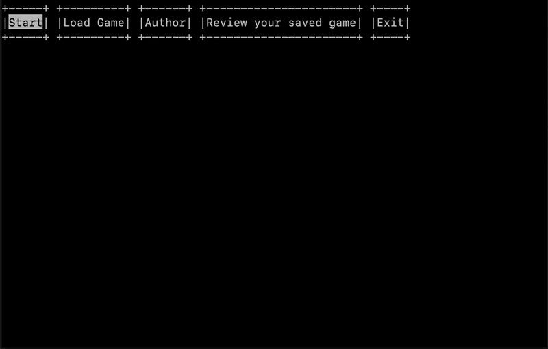

# Backgammon

A classic Backgammon board game implemented in C with a terminal-based UI using ncurses library.


## Gameplay Demo



## Features

- **Two-player gameplay** - Local multiplayer on the same machine
- **Full game logic** - Complete Backgammon rules implementation (dice rolling, bearing off, bar mechanics)
- **Save/Load system** - Save your game progress and continue later
- **Game replay** - Review previous moves
- **Hall of Fame** - Player rankings and score tracking
- **Terminal UI** - Clean ncurses-based interface with color support

## Tech Stack

| Component  | Technology  | Version             |
| ---------- | ----------- | ------------------- |
| Language   | C           | C99/C11             |
| Compiler   | GCC / Clang | GCC 11+ / Clang 15+ |
| Build Tool | Make        | 3.81+               |
| UI Library | ncurses     | 6.0+                |

## Requirements

### macOS (Tested)

```bash
# Install Xcode Command Line Tools (includes clang & make)
xcode-select --install

# Install ncurses via Homebrew
brew install ncurses
```

### Fedora / RHEL / CentOS

```bash
sudo dnf install gcc
sudo dnf install make
sudo dnf install ncurses-devel
```

### Ubuntu / Debian

```bash
sudo apt update
sudo apt install gcc make libncurses5-dev libncursesw5-dev
```

## Build & Run

```bash
# Clone the repository
git clone https://github.com/yourusername/backgammon.git
cd backgammon

# Compile
make

# Run
./my_program

# Clean build files
make clean
```

## Project Structure

- `main.c` - Program entry point, ncurses initialization
- `Makefile` - Build configuration
- `headers/` - Header files with function declarations and structures
- `src/` - Source files with game logic implementation
- `currentGame.txt` - Current game state (auto-saved after each move)
- `savedGame.txt` - Saved game
- `users.txt` - Player profiles and scores

## Controls

| Key     | Action                        |
| ------- | ----------------------------- |
| `←` `→` | Navigate menu / Select column |
| `Enter` | Confirm selection             |
| `↑` `↓` | Select pawn / target          |

## Game Rules

Standard Backgammon rules apply:

- Roll two dice to determine movement
- Doubles allow four moves instead of two
- Captured pawns go to the bar and must re-enter
- Bear off all 15 pawns to win

## Known Issues

- Terminal must support Unicode characters for pawn display
- Minimum terminal size: 80x24

## Tested On

| Platform                     | Status          |
| ---------------------------- | --------------- |
| macOS Sonoma (Apple Silicon) | ✅ Fully tested |
| macOS Ventura                | ✅ Fully tested |
| Fedora 39+                   | 🔄 Should work  |
| Ubuntu 22.04+                | 🔄 Should work  |

## License

This project is for educational purposes.

## Author

Jakub
